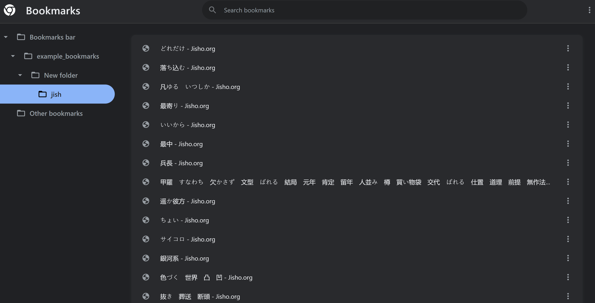
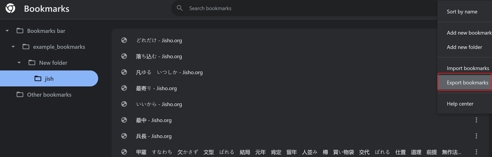
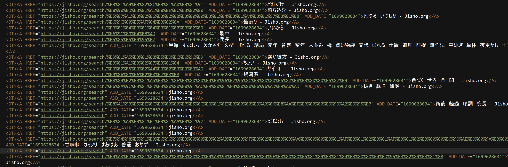

This repository does a number of things related to automatically generating Anki decks, or text files importable as Anki decks (the latter is normally my preference). The primary use case explained in this README is using `anki_deck_builder` to generate an Anki deck from a number of Jisho entries the user has collected over time in tabs in the Chrome browser.

Steps for use from a Python REPL or command-line are as follows:

0. Install [Fire](https://github.com/google/python-fire)
1. In your Chrome browser, move all Jisho tabs into a single Tab Group
2. Right Click on the `Tab Group`, and `Move group to new window`
3. In the new window containing the `Tab Group`, click `Bookmarks` and `Bookmark all tabs`. Make sure your bookmarks are saved in a new, clearly organized folder, especially if you have many Bookmarks
4. Create a new Chrome Profile (or reuse one that has no Bookmarks)
5. Follow [this brief GitHub tip](https://superuser.com/a/1101380/1255761) to move this folder of Bookmarks to your second, clean Chrome Profile. This involves opening both profiles in separate windows, Bookmark manager in both, and drag-and-dropping your desired folder of Jisho Bookmarks into the clean Chrome Profile's Bookmarks. Once your bookmarks are moved over, your screen should look similar to this reference:

Lastly, enter Bookmark Manager in the clean Chrome Profile and `Export Bookmarks`. Save these to an html file of your choosing; you will need to tell `anki_deck_builder` where to find this file. When exporting, your screen should look similar to this reference:

If you've followed this procedure successfully, you should now have a `.html` file stored locally on your computer with your Jisho entries in it. As an example, the contents of this file opened in a text editor might look like:

Once you have this file created locally, you can now execute `anki_deck_builder` in two steps:

First, to create a `words.json` file locally from searching the HTML and automatically looking up words via Jisho's API, enter a command like:
`python make_anki_cards.py search --inputf="bookmarks_example.html" --output_format="txt" --mode="NON-INTERACTIVE"`

Second, to create a tab-delimited text file from the `words.json` creaed in the prior step, and which can be imported as an Anki deck, enter a command like:
`python make_anki_cards.py generate --deckname="bookmarks_examples_deck"`

`anki_deck_builder` also contains a variety of related functionality, but is very much a perpetual work in progress. Use it at your own risk and without any assurance that it is bug-free, but also feel free to copy or branch it and modify it, and to explore its many undocumented functions.
